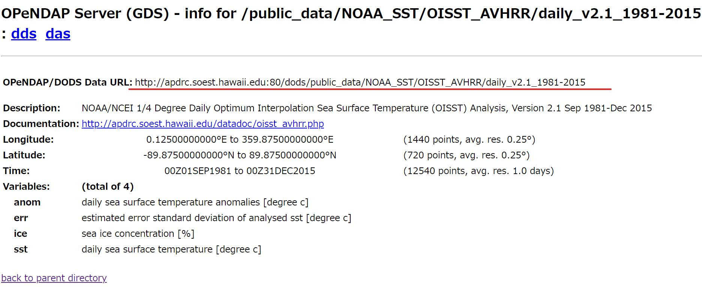

# Sattelite_Dataset

You can download satellite data through OPeNDAP using the ncks command.  
This python package (opendap) wraps the ncks command so please download the ncks command first before using this package.  
You can download the command if you follow the below instructions.  
After you install the ncks command, you can download data when you execute main.py in this directory.

## Installation

### Step1: download ncks command

Please type the below command in your shell,

```bash
conda install -c conda-forge pynco
which ncks
```

If you can sucessuflly download ncks command, you can see path of ncks from your prompt when you type "which ncks"

### Step2: download this package  

Please type the below command in your shell

```bash
pip install "git+https://github.com/Hiromi-Matsuura/Sattelite_Dataset.git#egg=opedap&subdirectory=opendap"
```

If you can sucessuflly download packages, you can import opendap in your python file.

## Usage

You just change arguments inside main.py
arguments -> url, span(start, end), area(west, east, south, north)

- Importing the opendap package and datetime

```python
from opendap import *
import datetime
```

- Selecting the area (We should specify 4 points, west and east longitudes and south and north latitudes)
- Selecting the span (We need datetime type and put those variables as attributes of Span class)
- Selecting the url  (You can get url through Asi-Pacific Data Center [hawaii](http://apdrc.soest.hawaii.edu/index.php))

```python
RESOLUTION = 0.25 
west  = Longitude(Position(118.125, RESOLUTION))
east  = Longitude(Position(240.125, RESOLUTION))
south = Latitude(Position(20.125, RESOLUTION))
north = Latitude(Position(50.250, RESOLUTION))
area  = Area(west, east, south, north)

start = datetime.datetime(1993, 1, 1)
end   = datetime.datetime(1993, 12, 31)
span  = Span(start, end)

url   = URL('http://apdrc.soest.hawaii.edu:80/dods/public_data/NOAA_SST/OISST_AVHRR/daily_v2.1_1981-2015')

```

- Making a downloder instance and a excecuter instance.
- excecute_downloads method start downloading data when you append downloader in excecuter instance

```python
downloader = OISST_downloader(url, area, span)
excecuter  = Excecuter()
excecuter.append(downloader)
excecuter.excecute_downloads()
```

## How to know the OpenDap URL

1. Go to the page  : [hawaii](http://apdrc.soest.hawaii.edu/index.php)
2. Select Data tab
3. Press a botton named OPeNDAP
4. Search URL like the below an image



### Refernces

- pynco: [pynco](https://github.com/nco/pynco)

### Lisence

This project is licensed under the MIT License, see the LICENSE.txt file for details
